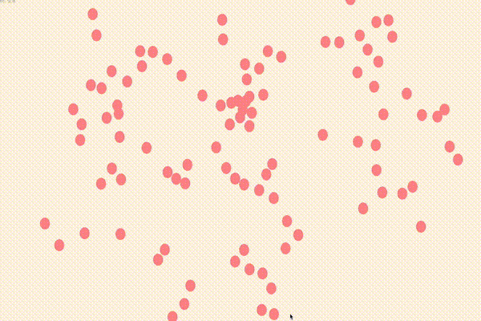

# boids-ebitengine

[](https://github.com/bioerrorlog/boids-ebitengine/actions/workflows/test.yml)

Boids flocking simulation with [Ebitengine](https://ebitengine.org/).


## Run on your local machine
```sh
go run github.com/bioerrorlog/boids-ebitengine@latest
```
